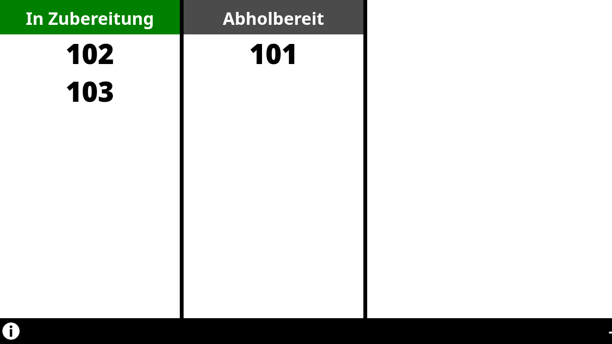

# Smart display for order-tracker

Smart order screen like at McDonald's.

## How does this work?

This python script launches a
- websocket server on localhost:8081
- HTTP-sevrer on localhost:8080
- chromium instance showing http://localhost:8080/index.html

Post a JSON of the following format to `http://localhost:8080/update`,
which updates the order numbers.

```json
{
    "preparing": [103, 104, 105],
    "finished": [101, 102]
}
```

Reverse-proxy or otherwise export `http://localhost:8080/update` if your
software that updates the display is hosted on another machine.

## Build and run

1. Install python >= 3.7 and chromium
2. Create a virtualenv directory: `python3 -m venv venv` and `source venv/bin/activate`
3. Install requirements: `pip install -r requirements.txt`
4. Run: `python3 display.py`

## Build for distribution

The included `build-dish.sh` script packages the python script as a standalone binary.

## Customization

You can place an mp4-video into `web/ad-video.mp4`. This will be played on the left pane.

You can otherwise customize the HTML files in the web directory. Using the `-r` option, you
can also specify a different webroot. The web-page just takes the above JSON and displays
the numbers.

## Demonstration Image



## Contributing and License

This code is Licenced under the MIT Licence. Feel free to use and fork.
